# Wireframe de Alta Fidelidade — IndieVerse

---

# 1. Landing Page

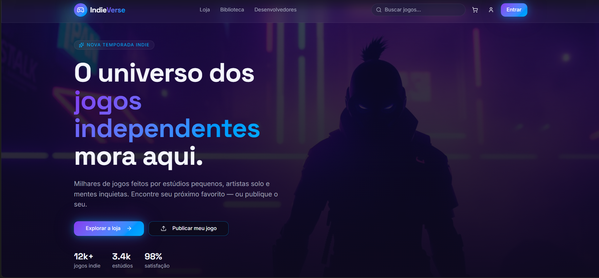

### Descrição
Tela inicial da plataforma IndieVerse, apresentando o marketplace de jogos independentes de forma moderna e futurista.

### Funcionalidades
- Navegação principal
- Busca de jogos
- Divulgação de jogos indie
- Acesso rápido para jogadores e desenvolvedores

---

# 2. Categorias e Destaques

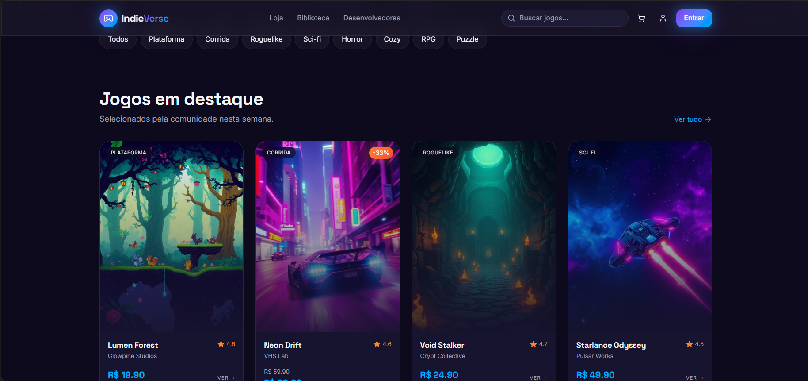

### Descrição
Sessão da página inicial responsável por exibir gêneros de jogos e os principais destaques da plataforma.

### Funcionalidades
- Visualização de categorias
- Jogos em destaque
- Navegação por gênero

---

# 3. Área do Desenvolvedor

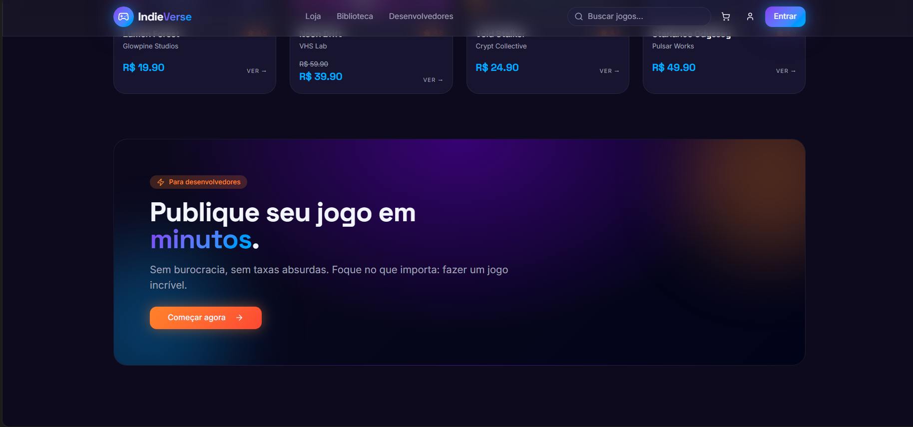

### Descrição
Sessão voltada para desenvolvedores publicarem seus jogos e acompanharem métricas da plataforma.

### Funcionalidades
- Publicação de jogos
- Acesso ao dashboard
- Visualização de métricas

---

# 4. Descobertas Recentes

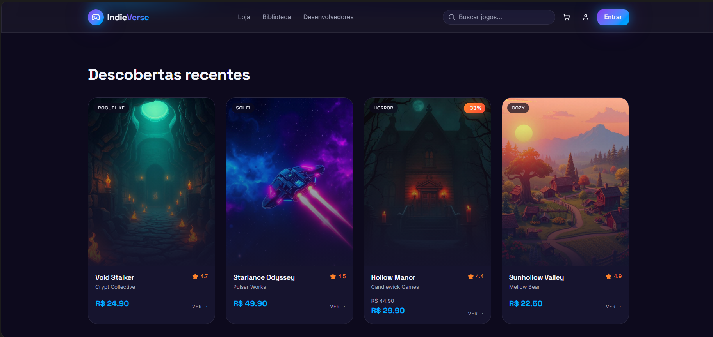

### Descrição
Área destinada à divulgação de novos jogos adicionados recentemente na plataforma.

### Funcionalidades
- Exibição de lançamentos
- Destaque para novos jogos
- Exploração de conteúdo recente

---

# 5. Rodapé

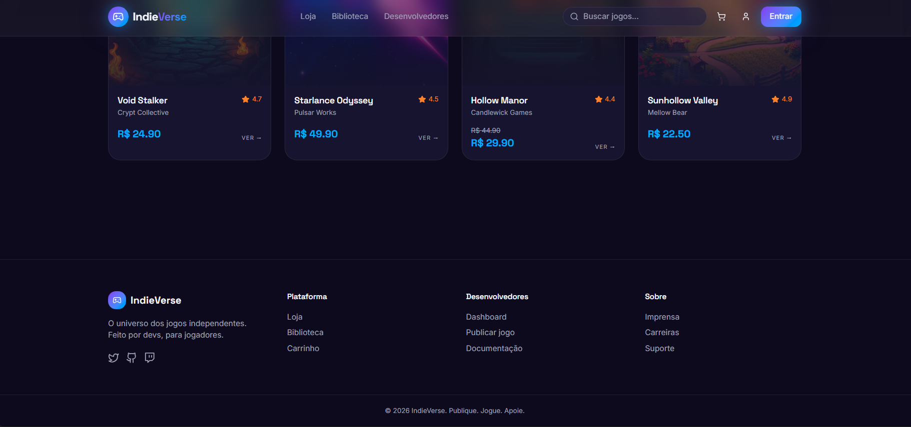

### Descrição
Rodapé contendo informações adicionais e links úteis da plataforma.

### Funcionalidades
- Informações institucionais
- Links rápidos
- Contato e suporte

---

# 6. Dashboard do Desenvolvedor

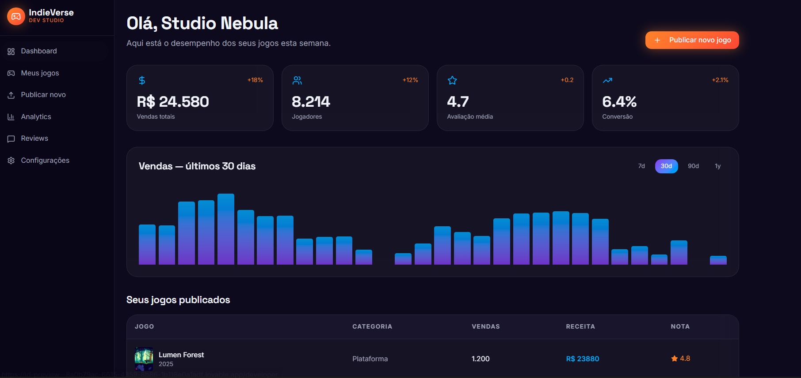

### Descrição
Tela onde o desenvolvedor acompanha métricas e visualiza os jogos publicados pelo estúdio.

### Funcionalidades
- Visualização de estatísticas
- Lista de jogos publicados
- Controle dos lançamentos

---

# 7. Tela de Login

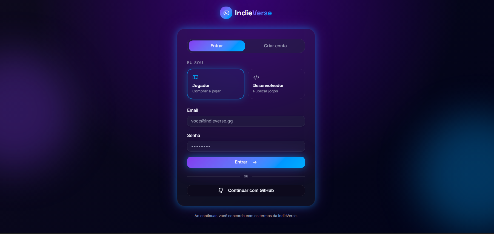

### Descrição
Tela responsável pela autenticação de usuários na plataforma.

### Funcionalidades
- Login de usuário
- Acesso para jogador e desenvolvedor
- Interface simples e intuitiva

---

# 8. Loja de Jogos

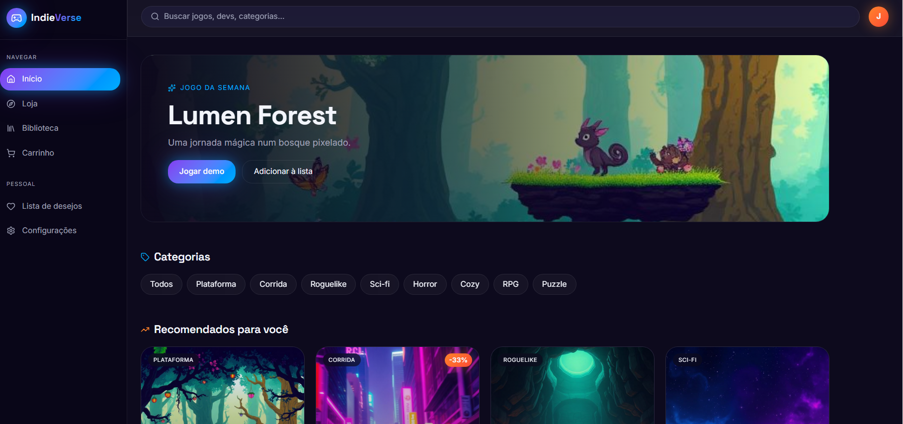

### Descrição
Tela principal da loja exibindo os jogos disponíveis na plataforma.

### Funcionalidades
- Navegação pelos jogos
- Busca de títulos
- Exploração do catálogo

---

# 9. Página do Jogo

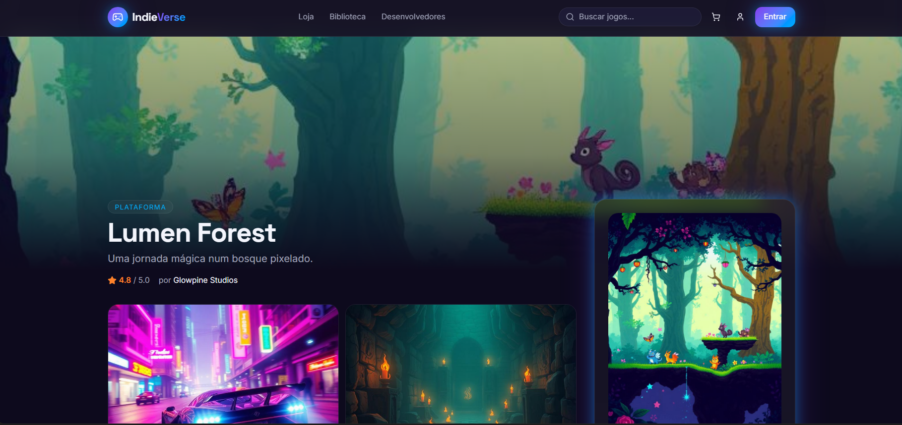

### Descrição
Tela com informações detalhadas de um jogo específico.

### Funcionalidades
- Exibição de banner
- Informações do jogo
- Reviews e avaliações

---

# 10. Informações e Compra do Jogo

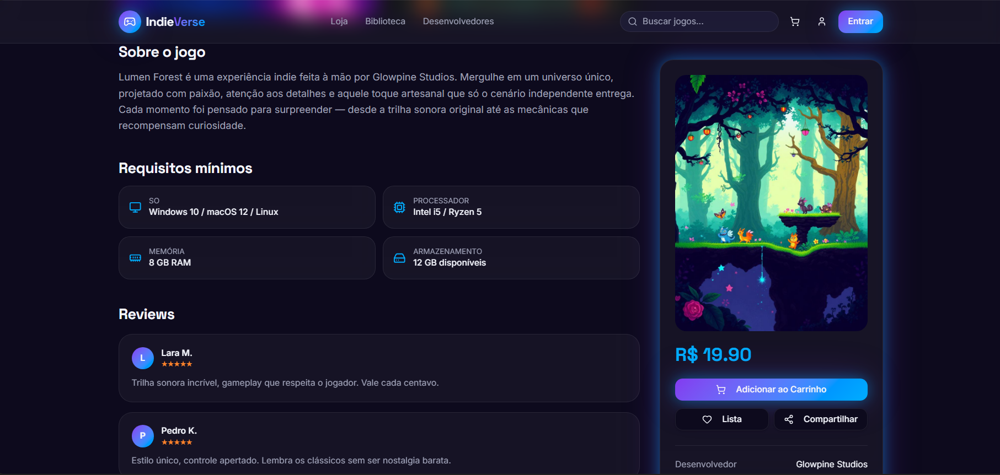

### Descrição
Seção complementar da página do jogo contendo mais detalhes e opções de compra.

### Funcionalidades
- Compra do jogo
- Visualização de reviews
- Requisitos mínimos

---

# 11. Carrinho

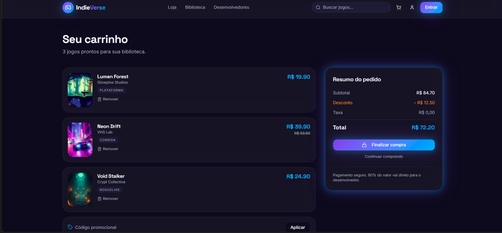

### Descrição
Tela responsável pela visualização dos jogos adicionados ao carrinho.

### Funcionalidades
- Resumo da compra
- Gerenciamento do carrinho
- Simulação de checkout

---

# 12. Biblioteca do Usuário

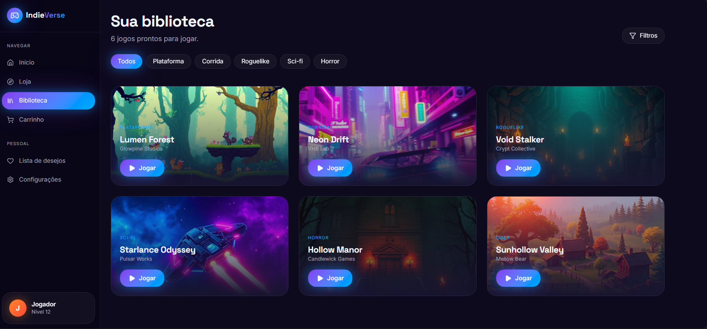

### Descrição
Tela onde o jogador visualiza os jogos adquiridos em sua conta.

### Funcionalidades
- Biblioteca pessoal
- Acesso aos jogos comprados
- Organização dos títulos adquiridos
```
